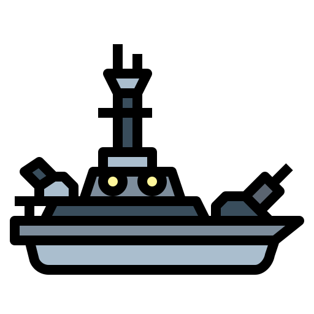

<h1 align="center">
  <br>
  <a href="#"></a>
  <br>
  Batalha Naval
  <br>
</h1>

# Descrição
Apenas um jogo simples para elucidar os conceitos aprendidos no grupo de estudos de programação em C++ da [IEEE Computer Society UFBA](https://github.com/IEEEComputerSocietyUFBA)

## Entendendo o código
Na pasta [`game`](game) você poderá encontrar os arquivos do jogo, desenvolvidos em ordem sequencial, para entender como o jogo funciona é importante que os arquivos sejam executados na ordem que os arquivos foram nomeados, até o final do desenvolvimento, espera-se que a pasta `game` possua os seguintes códigos:

```
.
├── 1-map.cpp
├── 2-game.cpp
├── 3-game_review.cpp
└── 4-game_ncurses.cpp
```

As funções de cada programa são:

- **1-map.cpp**: Mostrar a geração de mapas.
- **2-game.cpp**: Mostrar a mecânica geral do jogo.
- **3-game_review.cpp**: Apresentar como realizar otimização no programa. (Em breve)
- **4-game_ncurses.cpp**: Realização do jogo utilizando a biblioteca ncurses. (Em breve)

Para compilar e executar um programa destes, basta executar o comando com o nome de arquivo, com o terminal dentro da pasta `game`:

```g++ 1-map.cpp && ./a.out```

> O comando acima precisa do compilador g++ instalado na máquina, se você não sabe o que é isso, comece lendo sobre [por aqui](https://pt.wikipedia.org/wiki/GNU_Compiler_Collection)

## Contribuindo
Contribuições são o que tornam a comunidade de código aberto um lugar incrível para aprender, inspirar e criar. Todas as contribuições que você fizer são muito bem vindas! 

Se quiser "fortalecer" aí, pode abrir o pull request!! :heart_eyes:

## Licença
[GPL-3.0 License ](https://github.com/IEEEComputerSocietyUFBA/Batalha-Naval/blob/main/LICENSE)

<div>Icons made by <a href="https://www.flaticon.com/authors/smalllikeart" title="smalllikeart">smalllikeart</a> from <a href="https://www.flaticon.com/" title="Flaticon">www.flaticon.com</a></div>
